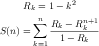

~~Remove~~
~Remove~

* PE479
> ~~公式推出了一半，根与系数的关系展开，最后得到，
> 然后算不动了。继续努力。~~ 到这一步已经是最后了，剩下的就需要算了，用快速幂取
> 模和扩展欧几里德。（第一次竟然没想到，估计连推导带实现总共花费了超过四个小时
> 。）

* PE479
> ~~公式推出了一半，根与系数的关系展开，最后得到， 然后算不动了。继续努力。~~ 
> 到这一步已经是最后了，剩下的就需要算了，用快速幂取模和扩展欧几里德。（第一次
> 竟然没想到，估计连推导带实现总共花费了超过四个小时。）
